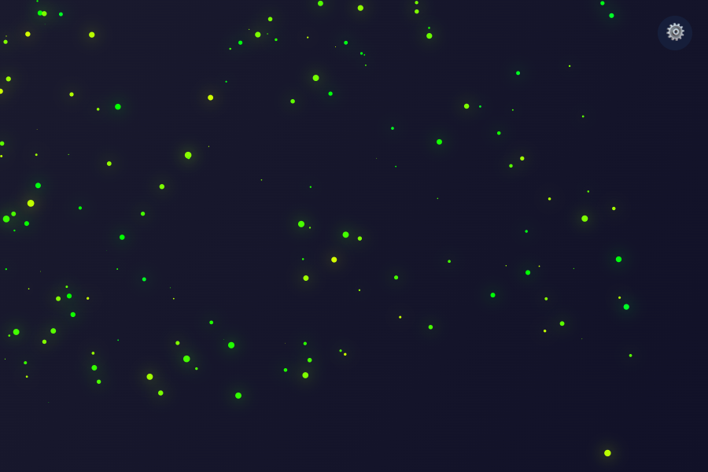

# ParticleFlow

Интерактивная полноэкранная система частиц с панелью настроек, пресетами и поддержкой PWA.

## Возможности

- **Полноэкранный canvas** с анимированными частицами и сглаживанием под Retina-дисплеи;
- **4 пресета настроек**: Calm, Neon, Storm, Minimal — быстрое переключение между сценариями;
- **6 цветовых палитр**: монохромная, холодная, тёплая, неоновая, радужная и пользовательская (3 кастомных цвета);
- **4 режима курсора**: притяжение, отталкивание, орбита и след;
- **3 режима фона**: сплошной, градиент, прозрачный;
- **Пульсация размера** частиц и **отражение от границ** экрана;
- **Свечение** (ShadowBlur) с регулировкой интенсивности;
- **Индикатор FPS** для отслеживания производительности;
- **Сохранение настроек** в `localStorage` — параметры восстанавливаются после перезагрузки;
- **PWA**: Service Worker для офлайн-работы, манифест для установки на устройство, иконки для iOS и Android.

## Пресеты настроек

| Пресет | Описание |
|--------|----------|
| **Calm** | Спокойные холодные тона, низкая скорость частиц, мягкое притяжение к курсору. |
| **Neon** | Яркие неоновые цвета, высокая скорость, орбитальное движение вокруг курсора, интенсивное свечение. |
| **Storm** | Хаотичное отталкивание от курсора, радужная палитра, высокая скорость, тёмный фон. |
| **Minimal** | Минималистичный режим: прозрачный фон, мало частиц, след курсора, почти без свечения. |

## Скриншоты



## PWA (Progressive Web App)

Проект является полноценным PWA и поддерживает установку на устройство:

- **Service Worker** ([`sw.js`](sw.js)) регистрируется при загрузке страницы и кэширует все статические файлы при первой установке;
- **Стратегия кэширования**: Cache-First — при последующих загрузках файлы отдаются из кэша, с fallback-запросом в сеть;
- **Манифест** ([`manifest.json`](manifest.json)) содержит метаданные для установки приложения на домашний экран;
- **Поддержка платформ**: Android (Chrome), iOS (Safari), Windows (Edge/IE);
- **Офлайн-режим**: после первого открытия приложение полностью работает без интернета.

## Запуск локально

Откройте файл [`index.html`](index.html) в браузере или запустите локальный сервер одним из способов:

```bash
# Способ 1: Python
python3 -m http.server 8000

# Способ 2: Node.js (npx)
npx serve . -p 3000 --no-clipboard
```

После этого откройте `http://localhost:8000/` или `http://localhost:3000/` соответственно.

## Структура проекта

```
├── index.html          # Основная разметка интерфейса и панели настроек
├── manifest.json       # PWA-манифест для установки на устройство
├── sw.js               # Service Worker для кэширования и офлайн-работы
├── css/
│   └── style.css       # Стили и оформление интерфейса
├── js/
│   └── script.js       # Логика анимации частиц, настроек, пресетов и PWA
├── icons/
│   ├── icon-192.png    # Иконка PWA 192×192
│   └── icon-512.png    # Иконка PWA 512×512
└── screenshots/
    └── pwa-check.png   # Скриншот приложения
```

## Развёртывание

Проект является статическим и может быть опубликован на **GitHub Pages** без сборки.

> **Важно:** при развёртывании в поддиректории (например, `https://user.github.io/ParticleFlow/`) необходимо обновить поле `"start_url"` в [`manifest.json`](manifest.json) на `/ParticleFlow/` (или соответствующую директорию), иначе PWA-установка может работать некорректно.
